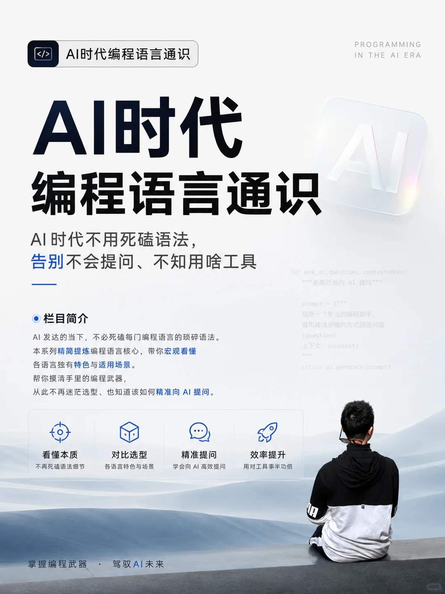
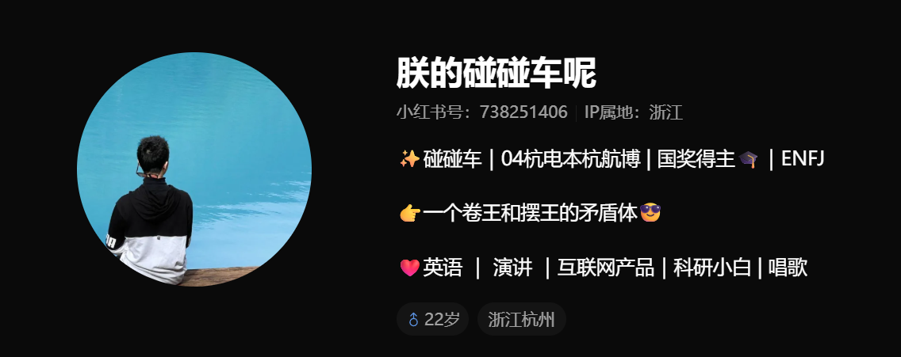

为什么我要做「AI时代编程语言通识」这个系列
这是一个预告，也是接下来一年会去做的事。
	
我也不知道这个系列会发展成什么样。
	
Every comment counts.
	
坦白说，前期内容可能会很浅。
	
我只是一名普通研0，对很多陌生编程语言和框架也还在摸索学习。
	
每一期，至少我自己能看懂，我才会发表。
	
如果你现在能看懂、觉得很简单、觉得方向对，不妨先点个关注。
	
或许到第10期，你会慢慢产生共鸣；
	
或许等到第50期，我们就能一起并肩成长、共同学习。
	
#编程 #ai编程 #ai #AI时代编程语言通识 #AI人工智能

为什么我要做「AI时代编程语言通识」这个系列?
坦白说，前期内容可能会很浅。我只是一名普通研0，对很多陌生语言也还在摸索学习。如果你现在能看懂、觉得方向对，不妨先点个关注。
或许到第10期，你会慢慢产生共鸣;或许等到第100期，我们就能一起并肩成长、共同学习。
在AI能写代码、能查语法、能解决bug的今天，我发现很多人学编程，还是在死磕每门语言的细碎语法，背一堆永远用不上的函数，到头来还是不知道:
这个场景该用什么语言?
向AI提问该怎么说才能精准解决问题?

这就是我做这个系列的初衷:
AI时代，学编程的逻辑早就变了。不用再死记硬背语法细节，我们只需要先搞懂:
每门语言的核心特色是什么?
它最擅长解决什么问题?
什么时候该把它放进你的「编程武器库」?
我会把传统教程里冗长的内容，提炼成你能快速看懂的通识内容，帮你建立对编程语言的宏观认知，从此不再迷茫选型，也能精准向AI提问，用对工具，事半功倍。
这是我的账号起点，也是我们一起重新理解编程的开始。
关注我，一起用AI的方式，高效学编程。
